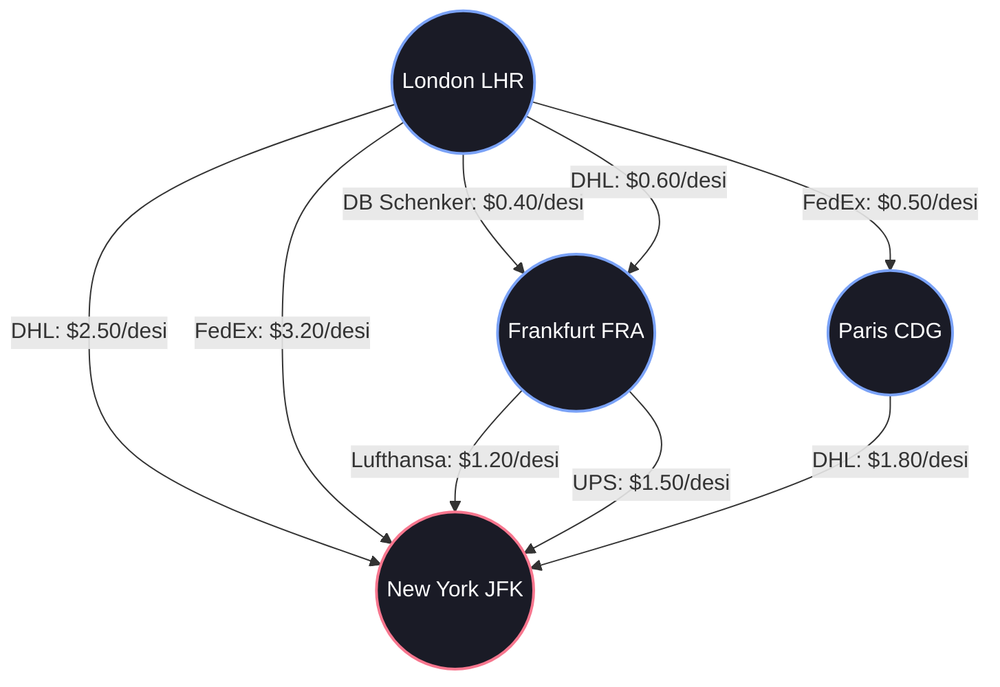
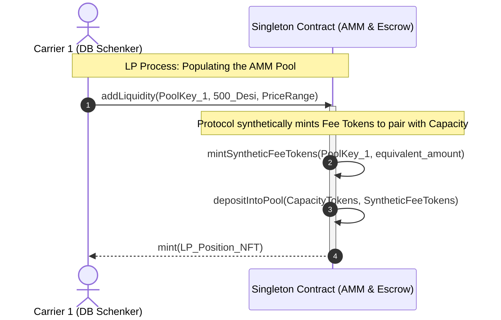
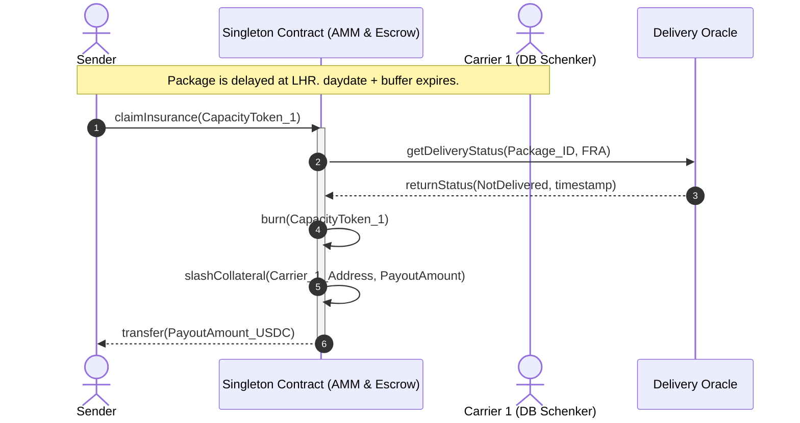
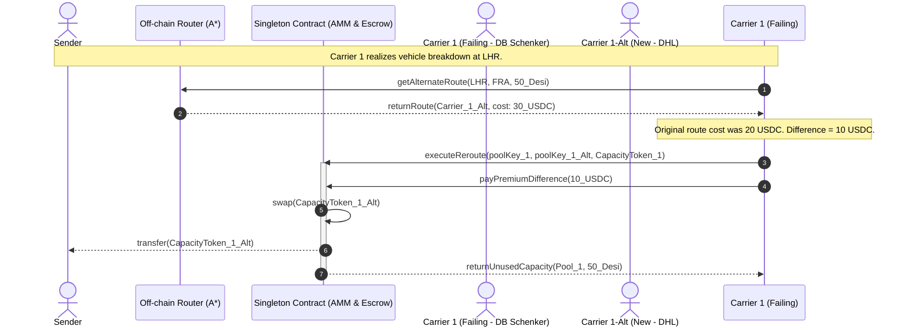

# Protocol for Tokenizing Real-World Future Services via Future Financial Obligations

This document outlines the architecture of a decentralized protocol designed to facilitate **Real-World Service Swaps**. By mapping physical service availability to tradeable assets, the protocol swaps **Future Obligations (Fee Tokens)** for **Future Services (Capacity Tokens)** using a Uniswap v4-inspired Singleton and Hook architecture. 

While this design uses **logistics and shipping** as its primary implementation case study, the underlying framework is generalizable to any network-based resource allocation problem (e.g., decentralized compute routing, telecommunications bandwidth, energy grid load balancing).

---

## 1. Core Narrative: Future Obligations for Future Services

In physical asset and service markets, direct settlement with spot assets (like stablecoins) is capital-inefficient. Because physical services require time to execute and are subject to real-world delays, the transaction itself must represent a binding agreement of future performance.

The protocol solves this by pairing two synthetic token types:
1.  **Fee (Receivable) Tokens**: Representing a future financial claim (backed by stablecoins locked in escrow).
2.  **Capacity (Service) Tokens**: Representing a carrier's future commitment to perform a service on a given path, date, and class.

Instead of paying a spot asset, the sender swaps a **Future Obligation** (Fee Token) to acquire a **Future Service** (Capacity Token). Settlement occurs incrementally as services are rendered, allowing for risk hedging, dynamic rerouting, and automated insurance without tying up spot capital in inactive intermediate positions.

---

## 2. Graph Routing Example: Global Hubs & Path Discovery

To demonstrate how the $A^*$ routing algorithm evaluates path pricing, consider a shipment of **50 Desi of Cargo** from **London Heathrow (LHR)** to **New York JFK (JFK)** scheduled for **2026-06-10**. 

The network contains multiple physical paths with different carriers (DHL, FedEx, UPS, DB Schenker, Lufthansa Cargo) operating concentrated liquidity pools (Singleton pools).

### 2.1. Available Paths & Pricing Matrix
The off-chain router pulls the pricing and capacity data from the pre-populated Singleton contract pools for the target date to calculate the total cost for the **50 Desi** shipment:

| Route ID | Path Breakdown | Carriers Involved | Cost per Desi | Total Price (50 Desi) | Available Capacity |
| :--- | :--- | :--- | :---: | :---: | :---: |
| **Path 1 (Direct)** | `LHR -> JFK` | DHL | $2.50 | $125.00 | 100 Desi |
| **Path 2 (Direct)** | `LHR -> JFK` | FedEx | $3.20 | $160.00 | 250 Desi |
| **Path 3 (via FRA)** | `LHR -> FRA -> JFK` | DB Schenker + Lufthansa | **$0.40 + $1.20 = $1.60** | **$80.00** | **150 Desi** (Min of 300 & 500) |
| **Path 4 (via FRA)** | `LHR -> FRA -> JFK` | DHL + UPS | $0.60 + $1.50 = $2.10 | $105.00 | 150 Desi |
| **Path 5 (via CDG)** | `LHR -> CDG -> JFK` | FedEx + DHL | $0.50 + $1.80 = $2.30 | $115.00 | 80 Desi |

> [!TIP]
> **Optimal Choice**: The $A^*$ router selects **Path 3 (via Frankfurt)** as the most fee-effective route ($80.00 total) and verifies that the 50 Desi demand fits within the 150 Desi available capacity bottleneck.

---

## 3. System Architecture & Pool Design

The service network is represented as a directed weighted graph $G = (V, E)$.

### 3.1. Pool Identifier (PoolKey)
A service liquidity pool is uniquely identified within the Singleton contract by:
$$\text{PoolID} = (\text{from}, \text{to}, \text{daydate}, \text{type})$$

*   `daydate`: Calendar day the service is scheduled.
*   `type`: Service classification enum (e.g., `Cargo`, `Document`, `Fragile`, `ColdChain`).

> [!IMPORTANT]
> **Activation Constraint**: Swapping capacity within a pool is only active **on or before** its specified `daydate`. Once the calendar date passes `daydate`, the pool is deactivated for swaps, preventing retroactive booking.

### 3.2. Liquidity Provision (LP) & Synthetic Minting
To maintain high capital efficiency, Carrier Liquidity Provision (LPing) happens **before** any route is calculated:
*   **LP Triggered Minting**: When a carrier provides liquidity, they commit physical Capacity. They do *not* lock stablecoins. To create a valid AMM pair `(Capacity Token, Fee Token)`, the protocol **synthetically mints Fee Tokens** for the LP to deposit into the pool alongside their Capacity Tokens.
*   **LP Position NFT**: The carrier receives a standard Uniswap v4-style LP NFT representing their concentrated liquidity position in the pool.

### 3.3. Sender Swap & Capacity Reclamation
*   **Sender Swap**: The sender locks USDC in escrow, minting USDC-backed Fee Tokens. The sender swaps these backed Fee Tokens into the pre-populated AMM pool to extract Capacity Tokens.
*   **Non-Optional Double Action**: Once a Fee Token is activated (via Oracle delivery confirmation), the performing carrier executes a transaction that performs **both** of the following actions:
    1.  **Redeem**: Burns the Fee Token to withdraw the corresponding stablecoins from the Singleton escrow.
    2.  **Reclaim**: Burns the Fee Token to reclaim their committed capacity slot.
*   **Capacity Deposition Choice**: Upon reclaiming the capacity slot, the carrier has the option to either redeposit the capacity back into the active AMM pool or retain it for private use.

---

## 4. Tokenomics & N-Hop Insurance

The sender holds capacity tokens representing the entire multi-hop route.

*   **Multiplier Structure**: For an $N$-hop route, the sender holds $N$ distinct Capacity Tokens (one for each leg).
*   **Targeted Insurance Claims**: Capacity tokens function as insurance policies. If a service failure occurs on Hop $i$, the sender can burn the specific Capacity Token for Hop $i$ to claim the insurance payout. 
*   **Carrier Slashing**: The payout is funded by slashing the collateral of **Carrier $i$ specifically**. 

---

## 5. Protocol Interaction Flows

The execution mechanics are separated into logical phases, starting from Liquidity Provision, to Routing, Swap, and Exception Handling.

### 5.1. Liquidity Provision (Pre-Routing)
This phase occurs **before** any routing calculations. Carriers provide physical capacity, triggering the synthetic minting of Fee Tokens to populate the AMM pools.

---

### 5.2. N-Carrier Happy Path Swap & Execution
This sequence details a successful 2-hop journey. Senders interact with the pre-populated pools created in Phase 5.1.

```mermaid
sequenceDiagram
    autonumber
    actor Sender
    participant Router as Off-chain Router (A*)
    participant Singleton as Singleton Contract (AMM & Escrow)
    actor Carrier 1 (DB Schenker)
    participant Oracle as Delivery Oracle
    actor Receiver

    Sender->>Router: getRoute(LHR, JFK, 50_Desi, Cargo, 2026-06-10)
    Router-->>Sender: returnRoute(Path_3, cost: 80_USDC)
    
    Sender->>Singleton: approve(80_USDC)
    Sender->>Singleton: executeSwap(poolKeys[1..2], slippageLimit)
    activate Singleton
    Note over Singleton: Sender mints backed Fee Tokens using USDC
    Singleton->>Singleton: mintBackedFeeTokens(80_USDC)
    Note over Singleton: Swaps backed Fee Tokens into pre-populated AMM pools
    Singleton->>Singleton: swapFeeForCapacity(Pool_1, Pool_2)
    Singleton-->>Sender: safeTransferFrom(ERC-1155 Capacity_1 & Capacity_2)
    deactivate Singleton

    rect rgb(20, 30, 40)
        note right of Carrier 1 (DB Schenker): Hop 1: LHR -> FRA Execution
        Carrier 1 (DB Schenker)->>FRA: Deliver package to Frankfurt Hub
        Oracle->>Singleton: reportDelivery(Package_ID, FRA, signature)
        Singleton->>Singleton: setFeeTokenActive(FeeToken_1, true)
        
        Carrier 1 (DB Schenker)->>Singleton: claimAndReclaim(FeeToken_1)
        activate Singleton
        Singleton->>Singleton: burn(FeeToken_1)
        Singleton->>Carrier 1 (DB Schenker): transfer(20_USDC)
        Singleton-->>Carrier 1 (DB Schenker): releaseCapacitySlot(Pool_1, 50_Desi)
        deactivate Singleton
    end
    
    Note over Sender, Receiver: (Hop 2 executes identically to Hop 1, omitted for brevity)
```

---

### 5.3. Insurance Payout Flow (Failure Case)
If a carrier fails to execute their hop within the expected timeframe, the Sender initiates the insurance claim.

---

### 5.4. Failure Mitigation & Dynamic Rerouting Flow
If Carrier 1 realizes they cannot perform Hop 1, they can trigger a reroute to avoid slashing.

